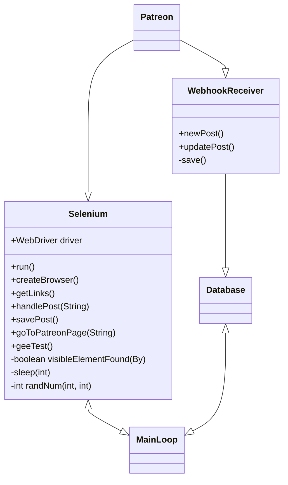

# Design

## Class Diagrams

### Gateway
```mermaid
classDiagram

<!--         BEANS         -->
<!--    REQUEST OBJECTS    -->
<!-- SENDING HTTP REQUESTS -->
<!-- ACTUAL JPA REPO STUFF -->
<!--       ENDPOINTS       -->
<!--         UTIL          -->
<!--        CONFIG         -->
<!--    OBJECT RESPONSES   -->
<!--       EXCEPTIONS      -->


    class PSApplication {
        +void main(String[])
    }

<!--    BEANS-->
    class PostBean {
        #String embedUrl
        #String appStatus
        #int postId
        #String appId
        #Boolean isPublic
        #List<Tag> tags
        #String publishedAt
        #String title
        #String embedData
        #String content
        #int campaignId
        #Boolean isPaid
        #String url
        +equals() boolean
    }

    class PatreonPostV2 {
        ~String embedUrl
        ~String appId
        ~String publishedAt
        ~String content
        ~Boolean isPublic
        ~String embedData
        ~String url
        ~String title
        ~Boolean isPaid
        ~String appStatus
    }

    class WebAccount {
        ~SocialIntegration socialIntegration
        #int webAccountId
        #String username
        #String loginToken
        #String password
        #String passwordSalt
        ~List<Tag> tags
        ~PatreonTokens creatorTokens
        ~OldPasswords oldPasswords
    }

    class User {
        +Data data
        +Links links
    }

    class Links {
        +String self
    }

    class Data {
        +Attributes attributes
        +float id
        +String type
    }

    class Attributes {
        ~Integer like_count
        ~String full_name
        ~String last_name
        ~String thumb_url
        ~String first_name
        ~Boolean can_see_nsfw
        ~String image_url
        ~String url
        ~Object social_connections
        ~String created
        ~Boolean is_email_verified
        ~String vanity
        ~Boolean hide_pledges
        ~String about
        ~String email
    }

    class SocialIntegration {
        #int webAccountId
        #String twitterAccessToken
        #String instagram
        #String twitterRefreshToken
        #String discord
        #WebAccount webAccount
    }

    class PatreonWebhookV2 {
        ~Boolean paused
        ~String uri
        ~String secret
        ~String lastAttemptedAt
        ~String numConsecutiveTimesFailed
        ~String[] triggers
    }

    class PatreonTokens {
        #int webAccountId
        #String refreshToken
        #int expiresIn
        #WebAccount webAccount
        #String accessToken
        #String scope
    }

    class PatreonDataV2 {
        ~Object attributes
        ~int id
        ~PatreonRelationshipsV2 relationships
        ~String type
    }

    class SearchFilter {
        -String filter
        -Long filterId
        -String filterName
        -int webAccountId
    }

    class OldPasswords {
        #WebAccount webAccount
        #int webAccountId
        #String oldPasswordThree
        #String oldPasswordTwo
        #String oldPasswordOne
    }

    class PatreonDataArrayEntryV2 {
        ~int id
        ~Object attributes
        ~String type
    }

    class ListBean {
        #listId
        #String title
        #String description
        #int webAccountId
    }

    class Tag {
        #int tagId
        #String tag
        #WebAccount webAccount
        #PostBean postBean
    }

    class PatreonObjectArrayV2 {
        ~PatreonDataV2[] data
        ~PatreonMetaV2 meta
    }

    class PatreonCampaignV2 {
        ~String vanity
        ~PatreonDataV2 data
    }

    class MembershipBean {
        -boolean is_follower
        -String patron_status
        -int campaignid
    }

    class ListPost {
        #int postId
        #String listPostsId
        #int listId
    }

    enum CreatorPageCategory {
        +WRITING
        +GAMES
        +VIDEO
        +MUSIC
        +PODCASTS
        +OTHER
        +COMICS
    }

    enum SocialIntegrationName {
        +TWITTER
        +INSTAGRAM
        +DISCORD
    }

    class PatreonCampaign {
        #Integer webAccountId
        #String vanity
        #Integer campaignId
    }

    class CreatorPage {
        #int campaignId
        #String pageCategory
        #String pageName
    }

    class PatreonMetaV2 {
        ~PatreonPaginationV2 pagination
    }

    class PatreonRelationshipsV2 {
        ~PatreonCampaignV2 campaign
    }

    class PatreonObjectV2 {
        ~PatreonDataV2 data
    }

    class PatreonPaginationV2 {
        ~int total
    }

    class PatreonLinksV2 {
        ~String self
    }


<!--      REQUEST OBJECTS-->
    class ListPostUpdateRequest {
        ~List<ListUpdate> listUpdates
        -String url
        -String loginToken
    }

    class ListUpdate {
        -boolean update
        -int listId
    }

    class WebhookRequest {
        ~PatreonDataV2 data
        ~PatreonLinksV2 links
    }

    class PutSocialIntegrationRequest {
        ~SocialIntegrationName socialIntegrationName
        ~String data
        ~String loginToken
    }

    class PostGetMultipleRequest {
        -String loginToken
        -List<String> creators
        -int page
    }

    class ResetPasswordRequest {
        ~String newPassword
        ~String loginToken
        ~String currentPassword
    }

    class ListCreationRequest {
       -String loginToken
       -String title
       -String description
    }

    class TagDeleteRequest {
        -String tag
        -String url
        -String loginToken
    }

    class TagAddRequest {
        -String loginToken
        -String url
        -String tag
    }

    PostWebhookRequest {
        -String loginToken
        ~SocialIntegrationName socialIntegrationName
    }

    class FavoriteListRequest {
        -String url
        -String loginToken
    }

    class ListDeleteRequest {
        -int list_id
        -String loginToken
    }

    class FilterAddRequest {
        -String filterName
        -String filter
    }

    class LoginRequest {
        -String username
        -String password
    }

    class RegisterRequest {
        ~String username
        ~String password
    }

    class FilterCommonRequest {
        -String loginToken
    }

    class FilterDeleteRequest {
        -long filterId
    }

    class ListUpdateRequest {
        -int list_id
    }

<!--      OBJECT RESPONSES-->
    class BaseResponse {
        -int status
        -String message
    }

    class LoginResponse {
        -String token
    }


<!--      SENDING HTTP REQUESTS-->
    class CustomPatreonAPI {
        -Logger log
        -String accessToken
        -ResourceConverter converter

        +List<MembershipBean> fetchFollowingCampaigns()
        -InputStream request(String, String, boolean)
        +JSONAPIDocument<User> fetchUser()
        +List<Pledge> fetchAllPledges(String)
        +JSONAPIDocument<List<Pledge>> fetchPageOfPledges(String, int, String, Collection<PledgeField>)
        +JSONAPIDocument<List<PostBean> fetchPosts(String)
        +JSONAPIDocument<List<Pledge>> fetchPageOfPledges(String, int, String)
        -String getVersion()
        -URIBuilder addFieldsParam(URIBuilder, Class<BaseResource>, Collection<Field>)
        +JSONAPIDocument<List<Campaign>> fetchCampaigns()
        +String getNextCursorFromDocument(JSONAPIDocument)
        -InputStream getDataStream(String, boolean)
    }


<!--      ACTUAL JPA REPO STUFF-->
    class WebAccountFunctions {
        ~WebAccountRepository webAccountRepository
        ~SecurityConfiguration securityConfiguration

        +void saveCampaignPosts(String, int)
        ~void sendTwitterPost(PatreonPostV2, WebAccount)
        +String PatreonOAuth(String, String)
        +String TwitterOAuth(String, String)
        -Object getCampaignData(String)
        -void createWebhookForPatreon(WebAccount, String, int)
        +ResponseEntity<?> PatreonWebhook(String, String, String, WebhookRequest, long)
        ~void sendDiscordMessage(PatreonPostV2, String)
    }

    class CreatorPageFunctions {
        ~CreatorPageRepository creatorPageRepository

        +void putCreatorPage(int)
    }

    class PatreonCampaignFunctions {
        ~PatreonCampaignsRepository patreonCampaignsRepository
        ~WebAccountFunctions webAccountFunctions
        ~ObjectMapper objectMapper

        +void getCampaign(Long)
        +PatreonCampaign getCampaignByWebaccountId(Long)
        +void putCampaign(String, PatreonDataArrayEntryV2)
        +void putCampaign(WebAccount, PatreonDataArrayEntryV2)
    }

    class PostsRepository {
        +List<PostBean> findAllByCampaignId(int)
        +Page<PostBean> getMultipleCreatorPosts(List<String>, Pageable)
        +PostBean findPostBeanByUrl(String)
        +List<PostBean> getExistingPosts(List<PostBean>)
        +List<Object[]> findPostsInListByListId(int, String)
    }

    class PostsRepositoryImpl {
        -EntityManager em

        -String getUrlList(List<PostBean>)
        +List<PostBean> getExistingPosts(List<PostBean>)
    }

    class ListsRepository {
        +ListBean getListByListId(int)
        +void deleteListByListId(int)
        +ListBean findListBeanByWebAccountIdAndTitle(int, String)
        +List<ListBean> findListBeansByWebAccountId(int)
    }

    class ListsRepositoryImpl {
        -EntityManager em
        +void deleteListByList_id(int)
        +ListBean getListByList_id(int)
    }

    class WebAccountRepository {
        +WebAccount findByUsername(String)
        +WebAccount findByWebAccountId(int)
        +WebAccount findByLoginToken(String)
    }

    class ListPostsRepository {
        +List<ListPost> findAllByListId(int)
        +List<ListPost> findAllByPostId(int)
        +void deleteByListAndPost(int, int)
    }

    class TagsRepository {
        +Tag findTagByPostBeanAndWebAccountAndTag(PostBean, WebAccount, String)
        +List<Tag> findAllByPostBean(PostBean)
    }

    class SearchFiltersRepositoryImpl {

    }

    class CreatorPageRepository {

    }


<!--      ENDPOINTS-->
    class ListSvc {
        -PostsRepository postsRepository
        -ListsRepository listsRepository
        -ListPostsRepository listPostsRepository
        -WebAccountFunctions webAccountFunctions

        +ResponseEntity<?> GetUserListsWithPost(String, String)
        +ResponseEntity<?> UpdateUserPostLists(ListPostUpdateRequest)
        +ResponseEntity<?> GetPostsFromList(String, int)
        +ResponseEntity<?> DeleteUserList(ListDeleteRequest)
        +ResponseEntity<?> DeletePostFromFavoritesList(FavoriteListRequest)
        +ResponseEntity<?> GetUserLists(String)
        +ResponseEntity<?> UpdateUserList(ListUpdateRequest)
        +ResponseEntity<?> AddPostToFavoritesList(FavoriteListRequest)
        +ResponseEntity<?> AddUserList(ListCreationRequest)
    }

    class ListImpl {
        +ResponseEntity<?> UpdateUserList(ListUpdateRequest)
        +ResponseEntity<?> AddUserList(ListCreationRequest)
        +ResponseEntity<?> AddPostToFavoritesList(FavoriteListRequest)
        +ResponseEntity<?> DeletePostFromFavoritesList(FavoriteListRequest)
        +ResponseEntity<?> GetUserListsWithPost(String, String)
        +ResponseEntity<?> DeleteUserList(ListDeleteRequest)
        +ResponseEntity<?> UpdateUserPostLists(ListPostUpdateRequest)
        +ResponseEntity<?> GetUserLists(String)
        +ResponseEntity<?> GetPostsFromList(String, int)
    }

    class WebAccountSvc {
        ~WebAccountFunctions webAccountFunctions

        +ResponseEntity<?> GetSocialIntegration(String)
        +ResponseEntity<?> ResetPassword(ResetPasswordRequest)
        +HttpStatus PutSocialIntegration(PutSocialIntegrationRequest)
        +ResponseEntity<?> Login(LoginRequest)
        +ResponseEntity<?> Logout(String)
        +HttpStatus Register(RegisterRequest)
        +ResponseEntity<?> Webhook(String)
        +ResponseEntity<?> GetPatreonTokens(String)
    }

    class WebAccountImpl {
        +ResponseEntity<?> Login(LoginRequest)
        +ResponseEntity<?> GetSocialIntegration(String)
        +ResponseEntity<?> GetPatreonTokens(String)
        +HttpStatus PutSocialIntegration(PutSocialIntegrationRequest)
        +HttpStatus Register(RegisterRequest)
        +ResponseEntity<?> ResetPassword(ResetPasswordRequest)
        +ResponseEntity<?> Logout(String)
    }

    class SearchFilterSvc {
        -WebAccountFunctions webAccountFunctions
        -SearchFiltersRepository searchFiltersRepository

        +ResponseEntity<?> GetUserFilters(String)
        +ResponseEntity<?> AddFilter(FilterAddRequest)
        +ResponseEntity<?> DeleteFilter(FilterDeleteRequest)
    }

    class TagSvc {
        ~PostsRepository postsRepository
        ~TagsRepository tagsRepository
        ~WebAccountFunctions webAccountFunctions

        +ResponseEntity<?> AddTag(TagAddRequest)
        +ResponseEntity<?> GetUserTagsOnSinglePost(String, String)
        +ResponseEntity<?> DeleteUserTagOnSinglePost(TagDeleteRequest)
    }

    class PostImpl {
        +ResponseEntity<?> GetCreatorPosts(int)
        +ResponseEntity<?> GetMultipleCreatorPosts(PostGetMultipleRequest)
    }

    class PostSvc {
        -WebAccountFunctions webAccountFunctions
        ~PostsRepository postsRepository

        +ResponseEntity<?> GetCreatorPosts(int)
        +ResponseEntity<?> GetMultipleCreatorPosts(PostGetMultipleRequest)
    }

    class BaseSvc {
        +ResponseEntity<?> catchSQLIntegrityConstraintViolationException(SQLIntegrityConstraintViolationException)
        +ResponseEntity<?> catchCustomException(PSException)
    }

    class ReceiverImpl {
        +String TwitterOAuth(String, String)
        +String PatreonOAuth(String, String)
        +ResponseEntity<?> PatreonWebhook(String, String, String, WebhookRequest, long)
    }

    class TagImpl {
        +ResponseEntity<?> GetUserTagsOnSinglePost(String, String)
        +ResponseEntity<?> DeleteUserTagOnSinglePost(TagDeleteRequest)
        +ResponseEntity<?> AddTag(TagAddRequest)
    }

    class SearchFilterImpl {
        +ResponseEntity<?> AddFilter(FilterAddRequest)
        +ResponseEntity<?> DeleteFilter(FilterDeleteRequest)
        +ResponseEntity<?> GetUserFilters(String)
    }

    class ListPostsRepositoryImpl {
        -EntityManager em
    }

    class TagsRepositoryImpl {
        -EntityManager em
    }


<!--      UTIL -->
    class DiscordWebhookUtil {
        ~FlexmarkHtmlConverter converter
        -WebhookEmbedBuilder embed
        -WebhookClient client

        +DiscordWebhookUtil(String)
        +DiscordWebhookUtil(String, PatreonPostV2)
        +void addField(String, String)
        +void setTitle(String)
        +void setTitle(String, String)
        +void setImage(String)
        +CompletableFuture<ReadonlyMessage> send()
        +void setDescription(String)
        +void close()
        +void setColor(int)
    }

    class TwitterApiUtil {
        ~TwitterApi client

        +void send(String)
        +void sendTweet(String, String, String, String, String)
    }

    class JSONUtil {
        -ObjectMapper mapper

        +JSONObject convertStringToJSONObject(String)
        +Object getBeanFromJSON(String, Class<T>)
    }

    class ResponseUtil {
        +ResponseEntity<?> Generic(HttpStatus, String)
    }


<!--      CONFIG-->
    class PSConfiguration {
        ~String twitterClientId
        ~String redirectUri
        ~String twitterClientSecret
        ~String twitterRedirectUri
        ~String clientId
        ~String clientSecret

        +PatreonOAuth oauthClient()
        +TwitterCredentials twitterClient()
        +PatreonCredentials patreonCredentials()
    }

    class JPAConfiguration {
        ~String dsUrl
        ~String dsUsername
        ~String dsPassword

        -HibernateJpaVendorAdapter vendorAdapter()
        +DataSource dataSource()
        ~LocalContainerEntityManagerFactoryBean entityManagerFactory()
        -Properties jpaHibernateProperties()
        +JpaTransactionManager transactionManager
    }

    class SecurityConfiguration {
        +String pepper
        ~PasswordValidator passwordValidator
        ~SecureRandom secureRandom

        +boolean passwordIsValid(String)
        +String encodePassword(String, String)
        +String SHA1Encoder(String)
        +boolean passwordMatches(String, String, String)
        +String createSalt()
    }

    class PatreonCredentials {
        -String clientSecret
        -String clientId
        -String redirectUri
    }

    class TwitterCredentials {
        -String redirectUri
        -String clientID
        -String clientSecret
    }

    class CorsFilter {
        +void destroy()
        +void doFilter(ServletRequest, ServletResponse, FilterChain)
        +void init(FilterConfig)
    }

    class CORSConfiguration {
        #void addCorsMapping(CorsRegistry)
    }


<!--      EXCEPTIONS-->
    class PSException {
        -HttpStatus httpStatus
        -String message

        +HttpStatus getHttpStatus()
        +String getMessage()
    }

<!-- not including PostGetter.java, CreatorTokens.java, CreatorTokensRepository.java, TagGetRequest.java, EndpointWrapper.java, SearchFiltersCustom as they aren't used -->
<!-- not including test classes: PostsTest.java, WebhookSvcTest.java -->


    User<|--Data
    User<|--Links
    Data<|--Attributes
    PSApplication<|--JPAConfiguration
    PSApplication<|--PSConfiguration
    PSConfiguration<|--OAuth
    JPAConfiguration<|--PostsRepository
    PostsRepository<|--Posts
    PostBean<|--Posts
    Posts<|--DiscordSender
    EndpointWrapper<|--DiscordSender
    PSApplication<|--EndpointWrapper
    EndpointWrapper<|--User
```
The gateway allows Patreon Shout to serve information from the database to the client. Everything begins in PSApplication, where Spring is first run. From here JPA is configured, which assists in handling storage and service of posts. PSConfiguration let's us handle OAuth requests using Client ID, Client secret, and a redirect URL. Spring handles a lot if it's data using endpoints. With EndpointWrapper we are able to send posts to platforms such as Discord, and recieve posts which can be broken down into smaller attributes to be served when requested.

### Patreon Post Parser


The post parser has two separate ways of getting posts from Patreon, with the first being from the Patreon API and the second being through webscraping. The reason behind webscraping is because the Patreon API only allows retrieving posts from creators we currently have an access token for. We get the information through the Patreon API by providing endpoints that will be triggered when specified creators create or update posts. These triggers will notify us to send that creator's post data to our database, and in turn, eventually be sent elsewhere. On the other hand, when we don’t have explicit permission from a content creator, we have a selenium-based web scraping application that will be searching every patreon creator we want for new posts periodically. When it finds a new post, the post data will subsequently be sent to our database to be sent elsewhere.

## Database Diagram


The database mostly focuses on the profile table, with it only having 1 instance per the multiple instances of objects in the posts. The profile table holds the main information about a user of Patreon Shout, such as their username, and who they follow. The profile table has a direct 1-to-1 relationship with the patreon_info table, which holds the user creator information that we may use to get the posts. If the user is not a creator, we will have an instance of an object relating to the profile so we could see if they are registered as a creator or as a user with Patreon Shout. Furthermore, the lists hold all the information needed for the user to create lists of creators that would overlap their main feed. This includes the name of the list, the creator that they added to the list, and the user that created the list. Finally, we have the posts table that holds the information of the post that we store to publish on different social media, or to publish it into our website. It will have the creator of the post, as well as all the information contained in the post itself such as the title, and the published date for us to show others.