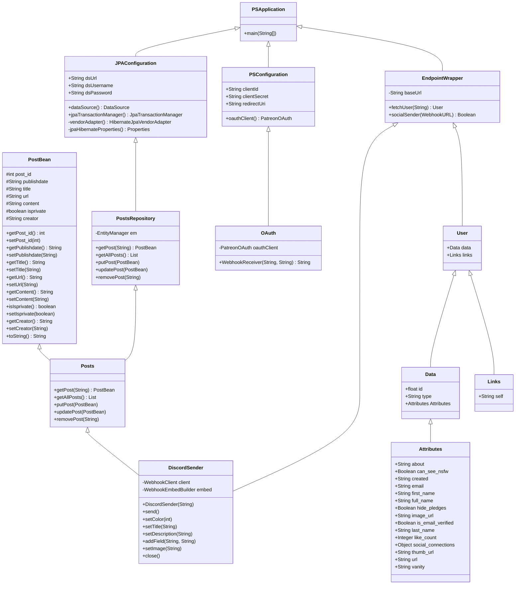
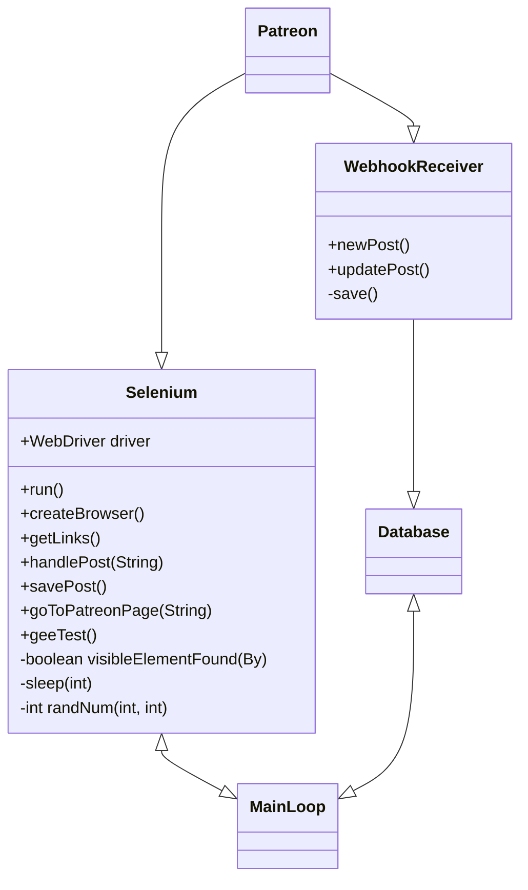

# Design

## Class Diagrams

### Gateway

The gateway allows Patreon Shout to serve information from the database to the client. Everything begins in PSApplication, where Spring is first run. From here JPA is configured, which assists in handling storage and service of posts. PSConfiguration let's us handle OAuth requests using Client ID, Client secret, and a redirect URL. Spring handles a lot if it's data using endpoints. With EndpointWrapper we are able to send posts to platforms such as Discord, and recieve posts which can be broken down into smaller attributes to be served when requested.

### Patreon Post Parser

The post parser has two separate ways of getting posts from Patreon, with the first being from the Patreon API and the second being through webscraping. The reason behind webscraping is because the Patreon API only allows retrieving posts from creators we currently have an access token for. We get the information through the Patreon API by providing endpoints that will be triggered when specified creators create or update posts. These triggers will notify us to send that creator's post data to our database, and in turn, eventually be sent elsewhere. On the other hand, when we don’t have explicit permission from a content creator, we have a selenium-based web scraping application that will be searching every patreon creator we want for new posts periodically. When it finds a new post, the post data will subsequently be sent to our database to be sent elsewhere.

## Database Diagram

The database mostly focuses on the profile table, with it only having 1 instance per the multiple instances of objects in the posts. The profile table holds the main information about a user of Patreon Shout, such as their username, and who they follow. The profile table has a direct 1-to-1 relationship with the patreon_info table, which holds the user creator information that we may use to get the posts. If the user is not a creator, we will have an instance of an object relating to the profile so we could see if they are registered as a creator or as a user with Patreon Shout. Furthermore, the lists hold all the information needed for the user to create lists of creators that would overlap their main feed. This includes the name of the list, the creator that they added to the list, and the user that created the list. Finally, we have the posts table that holds the information of the post that we store to publish on different social media, or to publish it into our website. It will have the creator of the post, as well as all the information contained in the post itself such as the title, and the published date for us to show others.