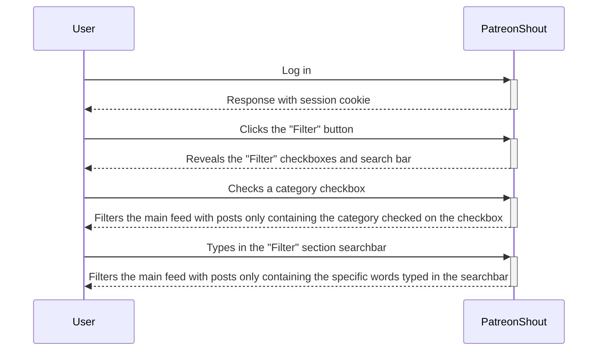
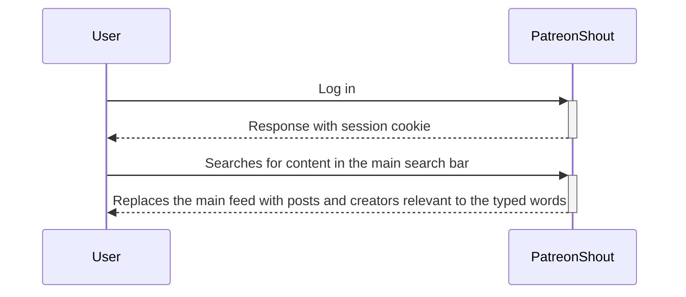

# Sequence Diagrams

### Use Case 1
As a creator, I want to be able to forward my Patreon posts to Discord and Twitter so that my outreach to future potential patrons is greater.
1. User signs up on the PatreonShout website.
2. User logs into PatreonShout website and is redirected to the main feed.
3. User clicks "Settings" and is directed to the Creator settings.
4. User clicks "Connect to Patreon" button and a new tab is redirected to Patreon's login page.
5. After logging into Patreon, the user is presented permissions that PatreonShout is requesting. User clicks "Allow".
6. Patreon redirects user back to PatreonShout.
7. PatreonShout informs user to go back to PatreonShout tab and refresh.
8. User switches Discord to ON and PatreonShout displays a Webhook URL text box and save button under the Discord section.
9. User enters their desired Discord channel's webhook URL into the Webhook URL text box then clicks save button.
10. Save button is grayed out for several seconds, then turns green, with its icon turning into a check mark.
11. Whenever the user publishes a post on Patreon, the post will subsequently be published to their Twitter and Discord.

[![](https://mermaid.ink/img/pako:eNqtWFlPI0cQ_iuVkVYBgQ14DYtHERIxm7AKAcSYRIl4ac-U7Rbj7kl3D8ZB_PdUz2F7Lh8b4MXuo-qr-2u_Ob4M0HEdjf_EKHy84mys2PRJAP1FTBnu84gJA48aVXX1nhmFUngTGZvq7p84vPR9GdNHD9UL97F65gF95C-omk946MeKmzn0pRjxcfXAFTNsyDQ2wnui_0-fSNWYa5ObYQ2C1sXFQcEId3EKpCjswAyHmptMC_MNf2EGV_xSOEyCWzX2u3D_OIAjEsXSjSO1AFUS3OS8W0mbio8nBuSoVsWl1vEUwUzoXCJdMcPJGmVjrA34UhjGhYYXFvIAuBhJNU2OpBqqMlM_lQLhAgodK7xnWs-kCv6w0mh7bx9SOaXz0Gp0ykDFuF53HmN35cQvsfAtat2OYpOt7e3v6KWY4icYfeAahDTAQoUsmEMeFwxSgTmANVbcSkClpNIwm6AAfCX7DRdj-HbrfX0YpHICXBvhZi-Q2lKmXg8G9-AZZmINneNjuPutkkTV-ixmqRVqM9iFK66jkM3hyflLxgqy9IQJ0zBEssYntxgMfnhyKnZUlaxspvWR1N-NHHOxvvjoCOWjkWsqr1xmB_VlducV6yxcKt-cY7PFiQeMJOmWat4ecRH8PH_M8iVPtC3ywl75Ua9s7VhmOltIv8dpNbejrOx-Z8afoN458W17SJyydV_4nnreDOdXFKhspqRgjHxG8SEO8q4vT74KO9_UXj9WCkmO4WT5AeRB3N_VsJttMS5zKS3-qnUf1VAaekWrWllF_ZVG0Mo6wQMGXKFPzpIwpXyAEdommJRwdgnuLmMzWV_K_ZD7z9ROPDQWs84bR6PevAMtLhTEN0iniIkMaz7snR174Ar0ovE1xuZLy75J7o_YGCFI0dvoRKimXGs7mYqqaMRktUbH6s1bWnYZhnJWclpKK8qUyV1sx2mniQUnLSlusAUATARFKJV0XLirnpCVV0tueyxrLMHegJuaNGqdwjlcrCocKdSTVZQbYCQT8SFrZyWn-GwaMT4WEFDh7Qav5mo9kLoJsmQpYyyzlFIPqCJoGB2btCfDWqp7SswCSeov17eGsFUT2hAXP-TUfdsjpFHVz5y5mFgbcvuxGL6sLYRSRkAsY5KEd7Gbbu6I6F5qs0CzOyKI7P3l7SW0wonlgW0imMhcIR-aveCeXdwvyvmY8Nk_FBnTTT58f5ZTmmX-G9i61R-XaLu3AIEzyPMNbJhtJU2kfAaiNrXdZ7vG0E_JsLXfSmuGVh1cnlFk016uIeTimVg1qQzROifveXX8d389g___kldoe_0UaCT9dWQvRZUMuEw36oR1ztKRmVGKyyCwo98nKptHZz2x8GacinZxhwb13W3TC7zILEpq4PHhBgy-GhjK12RE2iqDYWyM3GQRsW-TmsMVuUUTaVia4U8YsZIwbdxW009DdXRhtSVvG-uDdVC25FWEtZ5Trb7p2DBE8MpmbfmGKv1UoaXP6WUgDI7VFj8XbGwTXiLv21LeDm-qj6TG18ZE5Xf0Gq_2Kbrj3J9EdkJqJRTVsUIUO1zk9Nyy9-jxRvGcMvW8Pom_inIsnUNnSlST8cBxnTd7-8mh3JpSWrj0MbAiKUHe6RyLjfTmwndcQ0-zQyeOiMrkP_Y57oiFmlYjJv6Wcpofoq-O--a8Ou5Zt_25d3za63bPO93Oyfn5oTN33NZJr9NrH3_u9U7Oej1a_nL6fuj8m0jotL_Q0mm30z3u9c5OOmen7_8Br_z0Pg?type=png)](https://mermaid-js.github.io/mermaid-live-editor/edit#pako:eNqtWFlPI0cQ_iuVkVYBgQ14DYtHERIxm7AKAcSYRIl4ac-U7Rbj7kl3D8ZB_PdUz2F7Lh8b4MXuo-qr-2u_Ob4M0HEdjf_EKHy84mys2PRJAP1FTBnu84gJA48aVXX1nhmFUngTGZvq7p84vPR9GdNHD9UL97F65gF95C-omk946MeKmzn0pRjxcfXAFTNsyDQ2wnui_0-fSNWYa5ObYQ2C1sXFQcEId3EKpCjswAyHmptMC_MNf2EGV_xSOEyCWzX2u3D_OIAjEsXSjSO1AFUS3OS8W0mbio8nBuSoVsWl1vEUwUzoXCJdMcPJGmVjrA34UhjGhYYXFvIAuBhJNU2OpBqqMlM_lQLhAgodK7xnWs-kCv6w0mh7bx9SOaXz0Gp0ykDFuF53HmN35cQvsfAtat2OYpOt7e3v6KWY4icYfeAahDTAQoUsmEMeFwxSgTmANVbcSkClpNIwm6AAfCX7DRdj-HbrfX0YpHICXBvhZi-Q2lKmXg8G9-AZZmINneNjuPutkkTV-ixmqRVqM9iFK66jkM3hyflLxgqy9IQJ0zBEssYntxgMfnhyKnZUlaxspvWR1N-NHHOxvvjoCOWjkWsqr1xmB_VlducV6yxcKt-cY7PFiQeMJOmWat4ecRH8PH_M8iVPtC3ywl75Ua9s7VhmOltIv8dpNbejrOx-Z8afoN458W17SJyydV_4nnreDOdXFKhspqRgjHxG8SEO8q4vT74KO9_UXj9WCkmO4WT5AeRB3N_VsJttMS5zKS3-qnUf1VAaekWrWllF_ZVG0Mo6wQMGXKFPzpIwpXyAEdommJRwdgnuLmMzWV_K_ZD7z9ROPDQWs84bR6PevAMtLhTEN0iniIkMaz7snR174Ar0ovE1xuZLy75J7o_YGCFI0dvoRKimXGs7mYqqaMRktUbH6s1bWnYZhnJWclpKK8qUyV1sx2mniQUnLSlusAUATARFKJV0XLirnpCVV0tueyxrLMHegJuaNGqdwjlcrCocKdSTVZQbYCQT8SFrZyWn-GwaMT4WEFDh7Qav5mo9kLoJsmQpYyyzlFIPqCJoGB2btCfDWqp7SswCSeov17eGsFUT2hAXP-TUfdsjpFHVz5y5mFgbcvuxGL6sLYRSRkAsY5KEd7Gbbu6I6F5qs0CzOyKI7P3l7SW0wonlgW0imMhcIR-aveCeXdwvyvmY8Nk_FBnTTT58f5ZTmmX-G9i61R-XaLu3AIEzyPMNbJhtJU2kfAaiNrXdZ7vG0E_JsLXfSmuGVh1cnlFk016uIeTimVg1qQzROifveXX8d389g___kldoe_0UaCT9dWQvRZUMuEw36oR1ztKRmVGKyyCwo98nKptHZz2x8GacinZxhwb13W3TC7zILEpq4PHhBgy-GhjK12RE2iqDYWyM3GQRsW-TmsMVuUUTaVia4U8YsZIwbdxW009DdXRhtSVvG-uDdVC25FWEtZ5Trb7p2DBE8MpmbfmGKv1UoaXP6WUgDI7VFj8XbGwTXiLv21LeDm-qj6TG18ZE5Xf0Gq_2Kbrj3J9EdkJqJRTVsUIUO1zk9Nyy9-jxRvGcMvW8Pom_inIsnUNnSlST8cBxnTd7-8mh3JpSWrj0MbAiKUHe6RyLjfTmwndcQ0-zQyeOiMrkP_Y57oiFmlYjJv6Wcpofoq-O--a8Ou5Zt_25d3za63bPO93Oyfn5oTN33NZJr9NrH3_u9U7Oej1a_nL6fuj8m0jotL_Q0mm30z3u9c5OOmen7_8Br_z0Pg)

### Use Case 2
As a user, I want to be able to filter through the creators I’m following on Patreon, so I can easily view specific content, like the category “gaming”, from my list of creators I follow.
1. After logging into Patreon Shout, the user will be shown a Twitter-like feed of posts from the content creators they follow.
2. To filter through posts, the user will see a "Filters" button to the side of the search bar at the top of the screen.
3. In the “Filters” section, the user is shown a list of checkboxes to filter for specific categories and a search bar they can use to filter for specific words.
4. After clicking a category in the “Filters” section, only that category of posts is shown to the user on the main feed
5. After typing in the search bar in the “Filters” section, only the posts with the specific string of characters typed will show in the main feed to the user

### Use Case 3
As a user, I want to be able to search for Patreon posts from the entire list of my following creators, so I can easily get to specific posts that I want to revisit.
1. After logging into Patreon Shout, the user will be shown a Twitter-like feed of posts from the content creators they follow.
2. To search for specific Patreon posts, the user will see a large search bar near the top of their post feed and typing in this search bar will provide relevant posts based on the input provided.

### Use Case 4
As a user, I want to be able to view the posts of the content creators I follow in one place, so I can easily get updated on what posts have been published.
1. User signs up on the PatreonShout website.
2. User logs into PatreonShout website and is redirected to the main feed.
3. User clicks "Settings" and is directed to the Creator settings.
4. User clicks "Connect to Patreon" button and a new tab is redirected to Patreon's login page.
5. After logging into Patreon, the user is presented permissions that PatreonShout is requesting. User clicks "Allow".
6. Patreon redirects user back to PatreonShout.
7. PatreonShout informs user to go back to PatreonShout tab and refresh.
8. User goes to PatreonShout tab and clicks the "Home" button.
9. PatreonShout main feed now displays the content creators they are a patron to and content creators they follow.

[![](https://mermaid.ink/img/pako:eNqtWNtSIzcQ_ZXOVG0FCmwMeGE9D1tFDAmp7AKFTVJJ8SJm2h6FsTSRNHgdin9Pay72XH3ZwJNXanWfbnUfndlXx5M-Oq6j8Z8YhYeXnE0Vmz0KoL-IKcM9HjFh4EGjqq_eMaNQilEgY1Pf_QOfLjxPxvRzhOqFe1i3uUcP-QuqdosRerHiZgFDKSZ8Wje4ZIY9MY2t8Bo2pC5gehQfPhCQKdcmT9KmC53Pnw9KKbpLK5CitANzfNLcZBiYZ_gLM1ioWsmYHHcaquPC3cMYjsgVSzeO1BJUxXFbaW8kbSo-DQzISWOIC63jGYIJyC7xrpjhlI2yHUBV8aQwjAsNLyzkPnAxkWqWmKQR6j7TOlWuyQUUOlZ4x7SeS-X_br3R9t4-pH4q9tBpLcpYxbg-dt4BbsHi51h4FrXuRrHJ1vb2d6xSTPcnGP3gGoQ0wEKFzF9Afi_opw5zAGuyuJGASkmlYR6gAPxG-RsupvDrzejqfpz68XHtDbdXgcJWOvV6PL6DkWEm1nDS68Htb7Umqk9vuUutU9vBLlxyHYVsAY_OnzJWkLUnBEzDE1I2HpXFoP_Do1PLox6ksJnORzJ_X-SUi_XDRybUj0aumbzqmB00j9ntqDxn4Sr45h6bLy3uMZIUW6pFd8KF_9PiIeuXvNG26At75Edd2NpxzHS2kP47Tqe5G2Vj95UZL0C9c-NbekiKsjUvfM88b4bzCwpUtlNSMEY-o3iXAo2uL46vhH391N4wVgrJj-GU-QHkl7i_a2JftsW46qV0-OvZvRehtHBFpz5Z5fg1IuhkTHCPPlfoUbEkzKgfYIKWBJMRzg7B7UVsgvWjPAy590x0MkJjMeucOFrj5gy0PFBy3-KdbkxkWHMp4OzIgQXo5eQbks2XVrxJ5Y_YFMFP0dvbiVDNuNb2ZSqHoicmmzUya05vldlFGMp5pWiprKgKKne5HadMEwtOUVLcYAcAmPDLUGrtuCxXs1yrrlbK9lCNWIG9ATeRNGqdwjlcriqcKNRBEeUGGMmLeJ_RWaUoHptFjE8F-DR4u8FrONoMpOkFWamUKVZVSoUD6ghano5N0ZPHWqo7asySSBqu1reGsBUJbbgXL-TEvt0J0lM1zIq5fLE29PZD-foyWgiljIBURpBc73I33dwRkf1UWKLZHRFE9vzq9ApayWJlsM0NJj4L4kOzF9yzi_tlP-9zffYPRaZ0kx_f3-XUZln9xnZu9fs12u4UIHAOeb-lX4Q0SYGUz0DSppF9tiOGYSqGbf7WWzu0-sM1Mopy2ssjhFw8k6qmkCHa4uSc16R_99cr-P_vuSDbm1-BVtGfyYPkNQsl83VROWxUCZqeu2s5w2aJkBwqfM2TZLwibZ9MyFHGdNn4Fc3avw224-Z2XVXC0sLQdSTts02xv8ah4VGIOUEXGakyOOXwROVcJL2YsVCVHsvUw0KTrFgpEqnkJst8kuh1aS--HIdEWXpQPv1N8sjSH30tJJJa0u2NA-uw4thZTy7lEjVI1lpu28jHFIaGiZKz_B3U9mNnQTNvJRXQ5DNFkggiciWtCHIOnRlpNsZ9x3VebZxHh07YhnTpp8_Us03mjexYbORoITzHNfSNc-jEEWmC_P_UHHfCQk2rERN_STnLjeifjvvqfHPcwVl3cNofnPfPznv9497x2aGzcNzO8fnpoHvWG_R6n84_DXpnJx_fDp1_Ew8n3f7pyekJbXykY_3z4_7bfyPFvLc?type=png)](https://mermaid-js.github.io/mermaid-live-editor/edit#pako:eNqtWNtSIzcQ_ZXOVG0FCmwMeGE9D1tFDAmp7AKFTVJJ8SJm2h6FsTSRNHgdin9Pay72XH3ZwJNXanWfbnUfndlXx5M-Oq6j8Z8YhYeXnE0Vmz0KoL-IKcM9HjFh4EGjqq_eMaNQilEgY1Pf_QOfLjxPxvRzhOqFe1i3uUcP-QuqdosRerHiZgFDKSZ8Wje4ZIY9MY2t8Bo2pC5gehQfPhCQKdcmT9KmC53Pnw9KKbpLK5CitANzfNLcZBiYZ_gLM1ioWsmYHHcaquPC3cMYjsgVSzeO1BJUxXFbaW8kbSo-DQzISWOIC63jGYIJyC7xrpjhlI2yHUBV8aQwjAsNLyzkPnAxkWqWmKQR6j7TOlWuyQUUOlZ4x7SeS-X_br3R9t4-pH4q9tBpLcpYxbg-dt4BbsHi51h4FrXuRrHJ1vb2d6xSTPcnGP3gGoQ0wEKFzF9Afi_opw5zAGuyuJGASkmlYR6gAPxG-RsupvDrzejqfpz68XHtDbdXgcJWOvV6PL6DkWEm1nDS68Htb7Umqk9vuUutU9vBLlxyHYVsAY_OnzJWkLUnBEzDE1I2HpXFoP_Do1PLox6ksJnORzJ_X-SUi_XDRybUj0aumbzqmB00j9ntqDxn4Sr45h6bLy3uMZIUW6pFd8KF_9PiIeuXvNG26At75Edd2NpxzHS2kP47Tqe5G2Vj95UZL0C9c-NbekiKsjUvfM88b4bzCwpUtlNSMEY-o3iXAo2uL46vhH391N4wVgrJj-GU-QHkl7i_a2JftsW46qV0-OvZvRehtHBFpz5Z5fg1IuhkTHCPPlfoUbEkzKgfYIKWBJMRzg7B7UVsgvWjPAy590x0MkJjMeucOFrj5gy0PFBy3-KdbkxkWHMp4OzIgQXo5eQbks2XVrxJ5Y_YFMFP0dvbiVDNuNb2ZSqHoicmmzUya05vldlFGMp5pWiprKgKKne5HadMEwtOUVLcYAcAmPDLUGrtuCxXs1yrrlbK9lCNWIG9ATeRNGqdwjlcriqcKNRBEeUGGMmLeJ_RWaUoHptFjE8F-DR4u8FrONoMpOkFWamUKVZVSoUD6ghano5N0ZPHWqo7asySSBqu1reGsBUJbbgXL-TEvt0J0lM1zIq5fLE29PZD-foyWgiljIBURpBc73I33dwRkf1UWKLZHRFE9vzq9ApayWJlsM0NJj4L4kOzF9yzi_tlP-9zffYPRaZ0kx_f3-XUZln9xnZu9fs12u4UIHAOeb-lX4Q0SYGUz0DSppF9tiOGYSqGbf7WWzu0-sM1Mopy2ssjhFw8k6qmkCHa4uSc16R_99cr-P_vuSDbm1-BVtGfyYPkNQsl83VROWxUCZqeu2s5w2aJkBwqfM2TZLwibZ9MyFHGdNn4Fc3avw224-Z2XVXC0sLQdSTts02xv8ah4VGIOUEXGakyOOXwROVcJL2YsVCVHsvUw0KTrFgpEqnkJst8kuh1aS--HIdEWXpQPv1N8sjSH30tJJJa0u2NA-uw4thZTy7lEjVI1lpu28jHFIaGiZKz_B3U9mNnQTNvJRXQ5DNFkggiciWtCHIOnRlpNsZ9x3VebZxHh07YhnTpp8_Us03mjexYbORoITzHNfSNc-jEEWmC_P_UHHfCQk2rERN_STnLjeifjvvqfHPcwVl3cNofnPfPznv9497x2aGzcNzO8fnpoHvWG_R6n84_DXpnJx_fDp1_Ew8n3f7pyekJbXykY_3z4_7bfyPFvLc)

### Use Case 5
As a user, I want to be able to view and be notified of Patreon posts of my favorite creators on Discord, so I don’t have to use Patreon to learn about new posts and so I can be aware of the posts faster.
1. User finds the invite links to each Discord server of the content creators they follow.
2. After using the invite links to join every Discord server, the user will find the channel where Patreon notifications are output and will make sure to keep the channel unmuted for when notifications are sent out.
3. User will now receive notifications on Discord anytime there is a new Patreon post published by the creators who own the Discord server.

[](https://mermaid-js.github.io/mermaid-live-editor/edit#pako:eNqdVd9v2jAQ_ldOflmiAaWBZUkmVVrXPSBNbVXaVZryYpwDrIKd2Q60Q_zvc4jTUhI6rcmLcz--u_vufNkQJjMkCdH4u0DB8ILTmaLLVIB9cqoMZzynwsA1NUqKpvyCayZV1lR8U0iNVO1I2AblFOO5LExTe4MM-QoVjFGtOMOmxT1OvjImC3s8anMt9RvaC2rohGqrKd-qZOienX2sy0ysr8g0UJjKxUKuQZW8WUgjrYwCk8KgBWJ18c4Puhal60hMwKaJudFg5ngAVMZ1zFWBHSkJXBeTBddz1JDLKuAzke4AzzFqFq3X1fgWTvJKdrLGyVzKh5ONPdCKqlG2TQVlhq-owYMWPCPvvqt8DtuQWEnGFTJbzi7YTV1ISe6hdYXRbFQCMzRO5u0n53-pgMqn6eZ647qWwJSL7PzpxW6UeR4Xxgf-Cqh2cF1pS-dOo_qg91SVd1sKO4wmLS0Ib3GyP5gJaLpCr-zzOVLhv2S-b3VY_DGfg2pfB7qUgEpJpWE9RwH4iKwwXMxgdDn-fnNbobyOeqTefyK9YyLGknG6GNk7ZZeS4VKUs-EMe1b_Q864uJUPKDzf_59BacX23zMhFQzs4ej3jkorVJOvllvutsx9db3vDF94fk_bTeWVY390l13lKHT9CVPErHnnrceLw9txMjy6R9rX4E-Oaw1CGj7lbFcw0EkZVeC6hthtu1SQDlmiWlKe2Z_VpmQ4JXZ7LjEliT1mVD2kJBVba0cLI8dPgpHEqAI7pMgzm5L7sdVCu-5_Sbn_SZINeSRJN4jiXjAYxGEQD6N-P_rcIU8kCePesB8G_cEgiqM4HATbDvmzAzjtBWEQng7j8NNwEEXDINr-BQ2-ftE)

### Use Case 6
As a user, I want to be able to be notified of Patreon posts from my favorite creators on Instagram, so I don’t have to use Patreon to learn about new posts and so I can be aware of the posts faster.
1. User finds the Instagram accounts of each creator they follow.
2. User follows the content creator’s Instagram accounts.
3. User will now see an Instagram post on their Instagram feed anytime there is a new Patreon post published by the content creators they follow.
4. The user will see a picture and description uploaded by the creator notifying their followers about a new Patreon post, this Instagram post will not contain any information that a user would need a subscription to view.

[](https://mermaid-js.github.io/mermaid-live-editor/edit#pako:eNqdVd9v2jAQ_ldOflmiAaWho4knVWrXPSBNbVXaTZryYpwDrIKd2Q60Q_zvc0gClIRWa_Li3I_v7r47X1aEqwQJJQb_ZCg5Xgs20WweS3BPyrQVXKRMWrhjVitZlw-ksUdcvmlkVulmLGwCKxXDqcpsXXuPHMUCNQxRLwTHusUvHF1yrjJ3PGpzp8wb2mtm2YgZp8nfomhoX1x83hVKnbdMDDAYq9lMLUHn3DlQq5yMAVfSooPiVflbT2g7pHZJJQWXKqbWgJ3iAVQeu2SvCF4SQ-EuG82EmaKBVBUht2SWB9jGqJh0XrfDBzhJC9nJEkdTpZ5OVu7ACroGyTqWjFuxYBYP2rBF3nwX-Ry2gjpJIjRyV84m2H1VSE7woXWBUW8WhQnaUubtJ-d_LYDyp-5WwFWdozAWMrl62dkNEs8T0vogXgFVDmVXmtJ5NKg_mT1V4d2UwgajTksDwluc7A8nBcMW6OV9vkIm_V3m-1aHxR_zOaj2daAbBai10gaWU5SAz8gzK-QEBjfD7_cPBcrrqEfqfRfpAxMxVFyw2cDdKneJrFAyn43SsOP0P9REyAf1hNLz_f8ZlEZs_yMTUsDAHo756Kg0QtX5arjl2z1zmYpHK2ae3zFuU-V98_LBf2Oj3aYozU4AY8SkfvOd177Te_ESPLpRjq3EnwKXBqSyYiz4pnhgozy2xGUFstl8sSQtMkc9ZyJxv69VznZM3CadY0yoOyZMP8UklmtnxzKrhi-SE2p1hi2SpYlLqvzVETpmM-Okbv__VmpeGblPQlfkmdB2EEadoNeL-kF0Fna74XmLvBDajzpn3X7Q7fXCKIz6vWDdIn83AKedoB_0T8-isBudB9GXbrj-B_N2hsw)

### Use Case 7
As a user, I want to be able to be notified of Patreon posts from my favorite creators on Twitter, so I don’t have to use Patreon to learn about new posts and so I can be aware of the posts faster.
1. User finds the Twitter accounts of each creator they follow.
2. User follows the content creator’s Twitter accounts.
3. User will now see a Twitter post on their Twitter feed anytime there is a new Patreon post published by the content creators they follow.
4. The user will see a post uploaded by the creator notifying their followers about a new Patreon post, this Twitter post will not contain any information that a user would need a subscription to view.

[](https://mermaid-js.github.io/mermaid-live-editor/edit#pako:eNqdVd9v2jAQ_ldOflmiASVAA_WkSu26B6SprQrdpIkX4xxgFezMdkhbxP8-hyQtJaHVmrw49-O7u-_Olw3hKkJCicG_CUqOV4LNNVtNJLgnZtoKLmImLdwyq5WsysepsBZ1VfFdI7NK1yNhHVShGC1UYqvaO-Qo1qhhhHotOFYtfuP0gnOVuONRm1tl3tFeMcumzDhN9uYlQ_P8_GtZJnW-MjLAYKaWS5WCznhzkFY5GQOupEUHxMviCz9oOpRmQSIFlybG1oBd4AFQFrdgLg9ckELhNpkuhVmggVjlAV-ILA7wEqNk0XndjMZwEueykxSnC6UeTjbuwHKqhtF2Ihm3Ys0sHrTgBXn3nedz2AbqJJHQyF05u2B3ZSEZuYfWOUa1URTmaAuZt5-c_y0Hyp6qWw5Xdo3CTMjo8unVbhh5npDWB_EGqHQoulKXzr1B_cXsqXLvuhR2GFVaahDe42R_MCkYtkYv6_MlMum_Zr5vdVj8MZ-Dat8GulaAWittIF2gBHxEnlgh5zC8Hv24G-cob6MeqfdDpE9MxEhxwZZDd6fcUrJCyWw2CsOW0_9UcyHH6gGl5_v_Myi12P5nJiSHgT0c89lRqYWq8lVzy4stcxGLeyuWnt8ybkuNU0TrZXN_dJndxChN-QkzxKh66Z3Hq8MHgSI8uknqF-EvgakBqayYCb4rGdg0CysxLSF2-24iSYOsUK-YiNzvapNxPCFuf65wQqg7Rkw_TMhEbp0dS6waPUlOqNUJNkgSRy6l4tdG6IwtjZO6jf9HqVVp5D4J3ZBHQpvBWdgKer1-NxwEnaAd9roN8kRoL2y5YxB2Bt32oN0-7Wwb5HmHELQ6vdOzbq8b9oP-2aDfDrf_AIMigVg)